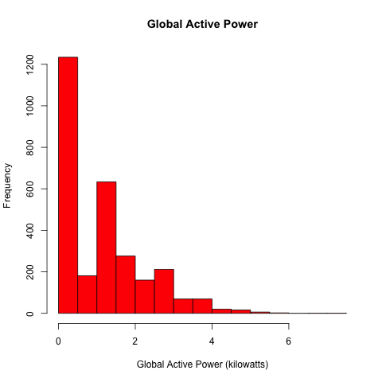
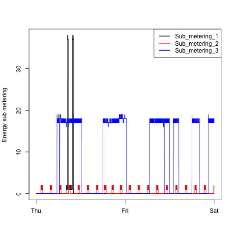
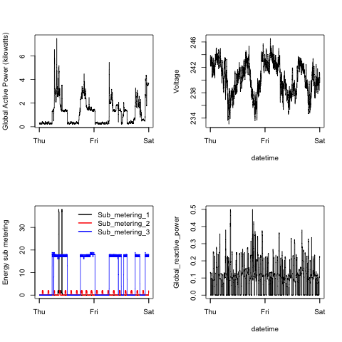

## Introduction
This is the assignment one of the Exploratory Data Analysis course.

The description can be found at <a href="https://github.com/rdpeng/ExData_Plotting1">rdpeng/ExData_Plotting1</a> repo or at the [ASSIGNMENT.md file](ASSIGNMENT.md).

## Plot Generation
Download the dataset and extract its contents into the same directory of this repo.

* <b>Dataset</b>: <a href="https://d396qusza40orc.cloudfront.net/exdata%2Fdata%2Fhousehold_power_consumption.zip">Electric power consumption</a> [20Mb]

Each plot can be generated by running <code>Rscript plotX.R</code> or all at once running <code>Rscript all.R</code>. 

## Results

The four resulting plots are shown below. 

### Plot 1

 

### Plot 2

 

### Plot 3

 

### Plot 4

 

